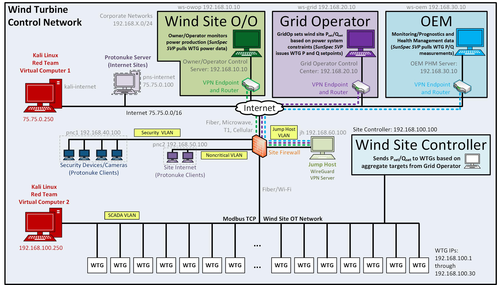
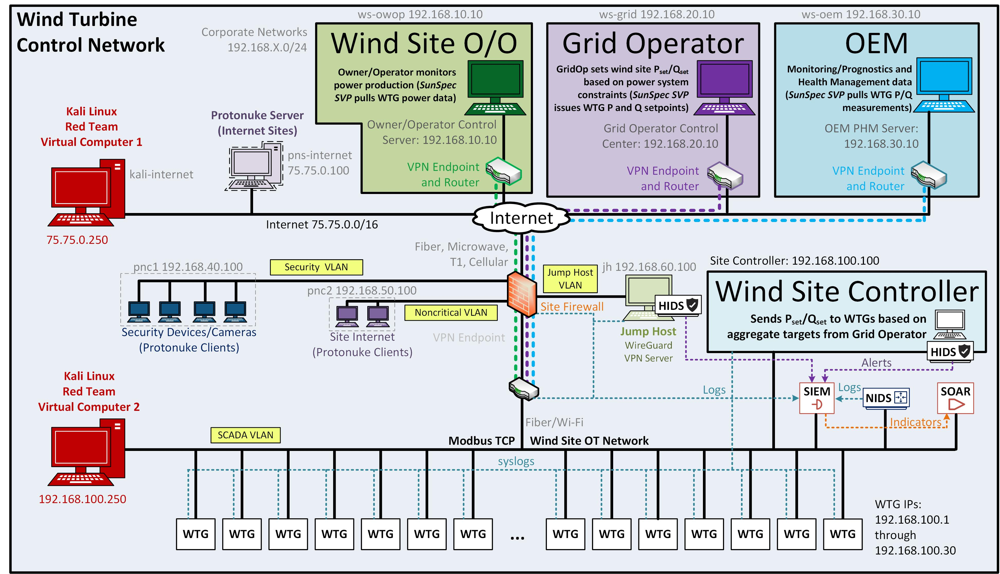

# Wind Architecture

## Background
These phēnix networks were created as part of the DOE WETO-funded "Hardening Wind Energy Systems from Cyber Threats" project. Some information on the project is located [here](https://www.energy.gov/sites/default/files/2021-10/fy21peerreview-gridintegration-snl-johnson2.pdf).

## Wind Turbine Plant Network

There are four topologies found in `phenix-configs`: 
* `base` - baseline, unsecured wind site topology.
* `hids` - wind site with Host-based Intrusion Detection System (HIDS); Wazuh.
* `nids` - wind site with Network-based Intrusion Detection System (NIDS); Zeek.
* `soar` - wind site with NIDS, HIDS, and Security Orchestration, Automation, and Response (Tool); there is a VM for SOAR
but it is not running a SOAR solution. There are several commercial solutions that can be deployed here. 

`base` is the base topology which is common across the remaining
three topologies. The four primary networks include the Wind Site
Owner or Operator, the Grid Operator, Original Equipment Manufacturer (OEM), and wind plant site. Each of the
networks illustrated on the top of Figure 1 have independent IPSec VPN
connections to the wind plant network. There are three Protonuke VMs used for
generating http, https, and smtp traffic to represent internet based noise in
the simulation. Figure 1 includes 30 VMs representing wind turbine generators
(WTGs), however, the topology only includes five VMs. One VM, `guard-cli`, is a
Wireguard client which represents the laptop of an OEM technician (not
represented on the illustration but is included in the topology).

Notes:

- It is possible to have any number of WTGs provided the hardware running
  minimega and phēnix have the resources to support them.
- We are using protonuke server on the WTGs and protonuke clients on the
  workstations generating http traffic to simulate OT traffic (this is only
  temporary until our plans for generating representative OT traffic are
  realized).


<p align = "center">
Figure 1: Baseline Environment.
</p>

Figure 2 illustrates the `soar` topology.


<p align = "center">
Figure 2: NIDS, HIDS, and SOAR Environment.
</p>
## Deploying in phēnix

The experiments described above have been designed to be deployed using
[phēnix](https://github.com/sandia-minimega/phenix). The easiest way to deploy
phēnix is to use the Docker Compose configs present in the `docker` directory of
the phēnix repository.

Since this repository relies on a custom phēnix user app, we recommend building
a custom Docker image for phēnix using the `Dockerfile` present in this
directory. This will use the latest phēnix Docker image and simply install the
custom phēnix user app (located in the `apps` directory) in it. Be sure to
update the `docker-compose.yml` file to use this custom image instead of the
default.

The phēnix topology configs in this repository include file injection references
to `/phenix/injects`. To ensure these injections work correctly, users need to
copy the contents of `phenix-injects` to `/phenix/injects` on the server where
phēnix is running (the "head node").

```
mkdir -p /phenix/injects && cp -a phenix-injects/* /phenix/injects
```

The phēnix topology configs in this repository include VM disk references to
`wireguard.qc2`, `windows-7.qc2`, and `zeek.qc2`, as well as more common images
like `vyos.qc2`, `miniccc.qc2`, `protonuke.qc2`, and `kali.qc2`. phēnix image configs for
`wireguard` and `zeek` are included in this repository in the `phenix-images`
directory and can be built with the `phenix image build` command. A Packer
configuration is also included in the `phenix-images` directory and can be be
built with ... wait for it ... Packer. phēnix comes with image configs for
`miniccc`, `protonuke`, and `kali` by default and thus they can also be built
with the `phenix image build` command. To build a VyOS image, clone the phēnix
repo and build from these
[instructions](https://github.com/sandia-minimega/phenix/tree/main/hack/vyos).

> **NOTE:** the `hids` and `soar` experiments described above include VM disk
> references to `wazuh-manager.qc2`, but we currently do not include a phēnix
> image config for `wazuh-manager`. One will be added in a future commit.

To create an experiment, add a topology and scenario file from `phenix-configs`
to the phēnix store either via the command line or the UI. Next, create an
experiment in the phēnix UI by referring to the appropriate topology and
scenario for the given network above.

Once you start the experiment, you can verify it is operating as expected by
checking the workstations on each network (e.g., `ws-ot`). They should all be
able to access the WTGs on the `192.168.100.0/24` network. You can also check
for `protonuke` logs on the WTGs to see that clients are connecting to them
(browse `/var/log/protonuke.log` via the VNC connection per VM).

- The username and password for any Linux VM is `root` with no password.
- The default username and password for a VyOS VM is `vyos` and `vyos`. However,
  you have an option of changing the password if you need to.
- The username and password for Kali VM is `root` and `toor` or `kali` and
  `kali` depending on the version of Kali that you create.
- The username and password for the Windows 7 image is `admin` and `password`.
