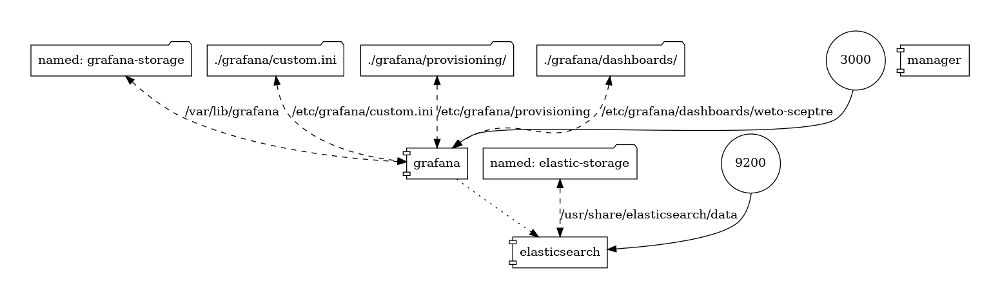

# Simulation Replay Environment


This repository contains the necessary simulation environment to replay
previously recorded data captured by the cybersecurity attack and monitoring
playbooks. These playbooks were developed to investigate cybersecurity attacks
and defenses without the co-simulation environment. The Grafana dashboards
provide live resilience data for wind site infrastructure.

# Table of Contents

- [Technology](#technology)
	- [Docker](#docker)
	- [Elasticsearch](#elasticsearch)
	- [Grafana](#grafana)
	- [Other](#other)
- [TLDR;](#tldr)
- [Section 01: Setup](#section-01-setup)
- [Section 02: Viewing Live/Streaming Data](#section-02-viewing-livestreaming-data)
- [Section 03: Simulation Environment Cleanup](#section-03-simulation-environment-cleanup)
	- [Remove Simulation Data](#remove-simulation-data)
	- [Clean Docker Environment](#clean-docker-environment)
- [Section 04: Data Generation \& Cleaning](#section-04-data-generation--cleaning)
	- [Datasource Variables](#datasource-variables)
	- [Dashboard UID Uniqueness](#dashboard-uid-uniqueness)
	- [Example](#example)
- [Section 05: Documenting](#section-05-documenting)
	- [Docker Infrastructure Visualization](#docker-infrastructure-visualization)
	- [Docker Container Analysis](#docker-container-analysis)
- [Credits](#credits)
- [Other Misc](#other-misc)
	- [Timestamp Conversions](#timestamp-conversions)

# Technology

## Docker

This environment was developed using Docker V20.10 and should work with any
version close to or greater than that. The version of docker compose was
originally targeted as V2.12 in order to make use of the profiles feature.
However, V2+ of docker compose was not widely adopted at the time of the
project. Therefore, a setup was configured where V1.29 of the docker compose
tool was itself ran inside of a docker container to prevent version conflicts
and to ease the use of this environment.



## Elasticsearch

The Elasticsearch database solution is used to store and collect all data
generated by the test environment.

## Grafana

The Grafana dashboard solution is used to generate visualizations of the data
generated by the test environment. Additionaly we use the [agenty flowcharting
plugin](https://grafana.com/grafana/plugins/agenty-flowcharting-panel/) to add
functionality allowing data to be visualized in a network diagram similar to
those used in IT/OT environments to identify assets on a network. Grafana uses
the data stored in Elasticsearch from the different simulations.

## Other

Other technologies used in this simulation environment include:

- Python: used to interact with Elasticsearch and load data
- Bash scripts: used for the main [setup file](./setup) to run all the necessary
functionality of the environment

# TL;DR

```bash
./setup test
./setup build
./setup start
./setup list_sim
./setup replay all
#visit http://localhost:3000
```

# Section 01: Setup

**All functionality for this simulation environment is achieved through the main
*[setup file](./setup) bash script.** It may be possible to use the script on a
*Windows system if a bash solution (i.e. Git-bash for Windows) exists, is able
*to run docker commands, and also contains the `sed` and `awk` commands.

This section assumes that the correct version of Docker and Docker compose is
already installed.

All commands should be run from the root directory of this repository. i.e. if
this repository was downloaded/cloned to
`/home/user/Downloads/dashboard-manager` then perform `cd
/home/user/Downloads/dashboard-manager && ./setup test` to validate you are in
the correct directory.

```bash
#initialize the docker setup
./setup build

#start docker and configure services
./setup start
```

Now visit [http://localhost:3000](http://localhost:3000) to view the Grafana
dashboard service and login with username `admin` and password `admin`. You
should now be able to see the dashboard [Wind Turbine Control
Network`](http://localhost:3000/dashboards) available in the `WETO-SCEPTRE`
folder.

# Section 02: Viewing Live/Streaming Data

The purpose of this simulation environment is to replay the data stored by
various simulations performed by the [research team](#credits).

NOTE: If the data you are using has recently been exported from the simulation
environment it may need to be cleaned. See [Section
04](#section-04-data-generation--cleaning) for more details.

1. Open the [Wind Turbine Control Network
SOUTH](http://localhost:3000/dashboards) dashboard.
1. Set the dashboard's time interval to 10s
1. List the available simulations to be performed: `./setup list_sim`.
   - The following list should be returned:
	 ```
	 ---Available simulations---
	 > INET_2
	 > INET_3
	 > INET_1
	 > OT_3
	 > INET_4
	 > baseline
	 > OT_5
	 > INET_5
	 > OT_1
	 > OT_2
	 > OT_4
	 ---------------------------
	 ```
1. Using an option from the list, run the command to replay the data from that
simulation: `./setup replay simulation_name`:
   - Replace the `simulation_name` parameter with the name from the list in step
   3.
   - Using the `all` simulation name will load all data from every available
   simulation into the database.
	 - It may take several minutes before data is populated within the dashboard.

# Section 03: Simulation Environment Cleanup

This section defines the various cleanup methods for this simulation
environment.

## Remove Simulation Data

After running a simulation, or multiple simulations, the data will persist in
the database until it is either deleted or the Docker infrastructure is
destroyed:

- `./setup refresh`: remove simulation data from the database

## Clean Docker Environment

If an issue arises with the Docker infrastructure then the envrionment can be
cleaned and restarted using the following methods:

- `./setup clean`: stops and removes all containers, images, and volumes used in
this environment
- You can validate the removal with the following commands (no containers with
labels/names starting with 'dashboard-manager' should remain)
  - `docker ps -a`: show docker processes
  - `docker image ls -a`: show all docker images
  - `docker container ls -a`: show all docker containers
  - `docker volume ls`: show all docker volumes

NOTE: there may be some build artifacts leftover such as default
elasticsearch/grafana containers. We do not attempt to delete these due to
possible naming similarities with other containers on the user's system.

# Section 04: Data Generation & Cleaning

There are some steps that need to be performed with data exported from the test
environment in order for it to be used in this simulation environment.

## Datasource Variables

The test environment uses some dashboards that contain datasource variables like
`${DS_DETECTIONS}`. These are currently [not
supported](https://github.com/grafana/grafana/issues/10786) by the provisioning
process so functionality has been added to the setup script to fix this. The
following steps detail how to remove datasource variables from the dataset.

- To start, remove any spaces in the filename with `./setup
remove_datafile_spaces` (run from project root directory).
- `./setup list_datasource_variables` This functionality will search through all
the exported json data files of grafana dashboards for any datasource UID that
contains the symbols `${}`.
  - NOTE: There may exist definitions for datasource expressions of the form
  `"${DS___EXPR__}`. These should not be replaced and are not affected by the
  provisioning errors mentioned earlier in this section.
  - NOTE: These UID values will be found in the datasource settings for a
  dashboard's panels and are different from the dashboard's UID value which is
  discussed in the next sub-section.
- Use the printed variables to determine the UID of the appropriate datasource.
Define this mapping in `manager/index_datasource_cleaning.csv` where the first
column contains the variables that were just printed out and the second column
is the UID of the appropriate matching datasource that would be defined in
`grafana/provisioning/datasources/all.yml`
- `./setup convert_datasource_variables` will then use the value mappings you
defined in `manager/index_datasource_cleaning.csv` and replace all instances of
datasources in the first column of the csv with the values defined in the second
column of the csv.

## Dashboard UID Uniqueness

Dashboard UIDs must be unique within the simulation grafana environment. If no
dashboards are showing in the Grafana instance then perform the following steps
to see if there are duplicate dashboard UIDs.

- Find duplicate UIDs: `./setup find_duplicate_dashboard_uids`
- if any output is returned, then that indicates there are multiple dashboards
using the same UID

## Example

Find all instances of datasource variables

```bash
$ ./setup list_datasource_variables
grafana/dashboards-copy/Wind_Turbine_Control_Network-1670362799477.json:        "uid": "${DS_DETECTIONS}"
grafana/dashboards-copy/Wind_Turbine_Control_Network-1670362799477.json:        "uid": "${DS_DETECTIONS}"
grafana/dashboards-copy/Wind_Turbine_Control_Network-1670362799477.json:        "uid": "${DS___EXPR__}"
grafana/dashboards-copy/Wind_Turbine_Control_Network-1670362799477.json:        "uid": "${DS_NOZOMI}"
grafana/dashboards-copy/Wind_Turbine_Control_Network-1670362799477.json:        "uid": "${DS_NOZOMI}"
grafana/dashboards-copy/Wind_Turbine_Control_Network-1670362799477.json:        "uid": "${DS_TESTS}"
grafana/dashboards-copy/Wind_Turbine_Control_Network-1670362799477.json:        "uid": "${DS_TESTS}"
grafana/dashboards-copy/Wind_Turbine_Control_Network-1670362799477.json:        "uid": "${DS_WAZUH}"
grafana/dashboards-copy/Wind_Turbine_Control_Network_Copy-1670362768583.json:   "uid": "${DS_DETECTIONS}"
grafana/dashboards-copy/Wind_Turbine_Control_Network_Copy-1670362768583.json:   "uid": "${DS_DETECTIONS}"
grafana/dashboards-copy/Wind_Turbine_Control_Network_Copy-1670362768583.json:   "uid": "${DS___EXPR__}"
grafana/dashboards-copy/Wind_Turbine_Control_Network_Copy-1670362768583.json:   "uid": "${DS_NOZOMI}"
grafana/dashboards-copy/Wind_Turbine_Control_Network_Copy-1670362768583.json:   "uid": "${DS_NOZOMI}"
grafana/dashboards-copy/Wind_Turbine_Control_Network_Copy-1670362768583.json:   "uid": "${DS_TESTS}"
grafana/dashboards-copy/Wind_Turbine_Control_Network_Copy-1670362768583.json:   "uid": "${DS_TESTS}"
grafana/dashboards-copy/Wind_Turbine_Control_Network_Copy-1670362768583.json:   "uid": "${DS_WAZUH}"
```

After determining the field values being used within each dashboard panel
utilizing these datasource variables, the following
index_datasource_cleaning.csv was created:

```csv
Given Index Name, New Index Name
${DS_NOZOMI},PEF04DE3072C5E4DD
${DS_DETECTIONS},P21F47EFF8DA6823A
${DS_TESTS},PE5C9D7030BADA2FE
```

Then the conversion function was run and gave the following output:

```bash
$ ./setup convert_datasource_variables
${DS_NOZOMI} -->> PEF04DE3072C5E4DD
${DS_DETECTIONS} -->> P21F47EFF8DA6823A
${DS_TESTS} -->> PE5C9D7030BADA2FE
```

No more datasource variables exist in the dashboards

# Section 05: Documenting

This simulation environment contains various documentation that is generated
using the processes defined below.

## Docker Infrastructure Visualization

> All commands in this section can be ran using `./setup document`

A network graph showing the layout and connections of the Docker infrastructure
is generated using the [pmsipilot/docker-compose-viz
project](https://github.com/pmsipilot/docker-compose-viz). This is the same
diagram seen in the [Technology](#technology) section.

Generate graph: `./setup dockerviz`

## Docker Container Analysis

A software bill of materials (SBOM) and vulnerability analysis have been
generated for the docker containers in use for this environment. SBOM has been
generated with Syft and the vuln-analysis performed by Grype by running the
`./setup dockersecurity`

- [Grafana SBOM](docs/sbom-grafana.md)
- [Grafana Analysis](docs/vuln-grafana.md)
- [Elasticsearch SBOM](docs/sbom-elasticsearch.md)
- [Elasticsearch Analysis](docs/vuln-elasticsearch.md)
- [Datamanager SBOM](docs/sbom-datamanager.md)
- [Datamanager Analysis](docs/vuln-datamanager.md)
- [Docker/Compose SBOM](docs/sbom-docker-compose:V1.29.md)
- [Docker/Compose Analysis](docs/vuln-docker-compose:V1.29.md)

# Credits

This work was completed under the "Hardening Wind Systems from Cyber Threats"
project, funded by the U.S. DOE Wind Energy Technologies Office (WETO).

# Other Misc

## Timestamp Conversions

In the process of replaying simulation data, this simulation environment
performs some conversion operations on the timestamps of provided datasets. When
attempting to determine the datetime ranges of the provided datasets, this
environment will convert any timezone aware timestamps into naive timestamps.
This may cause problems with some experimental data if the timezone information
is not converted properly. See manager/utilities.py:determine_date_range() to
understand how the timestamps are being converted.