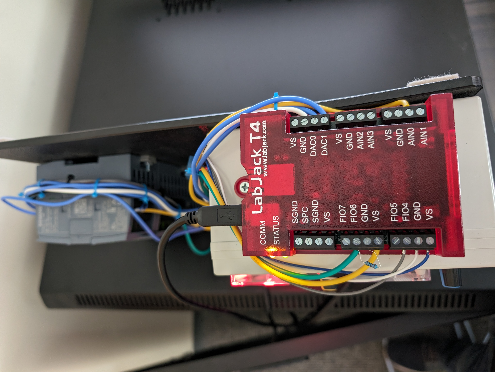
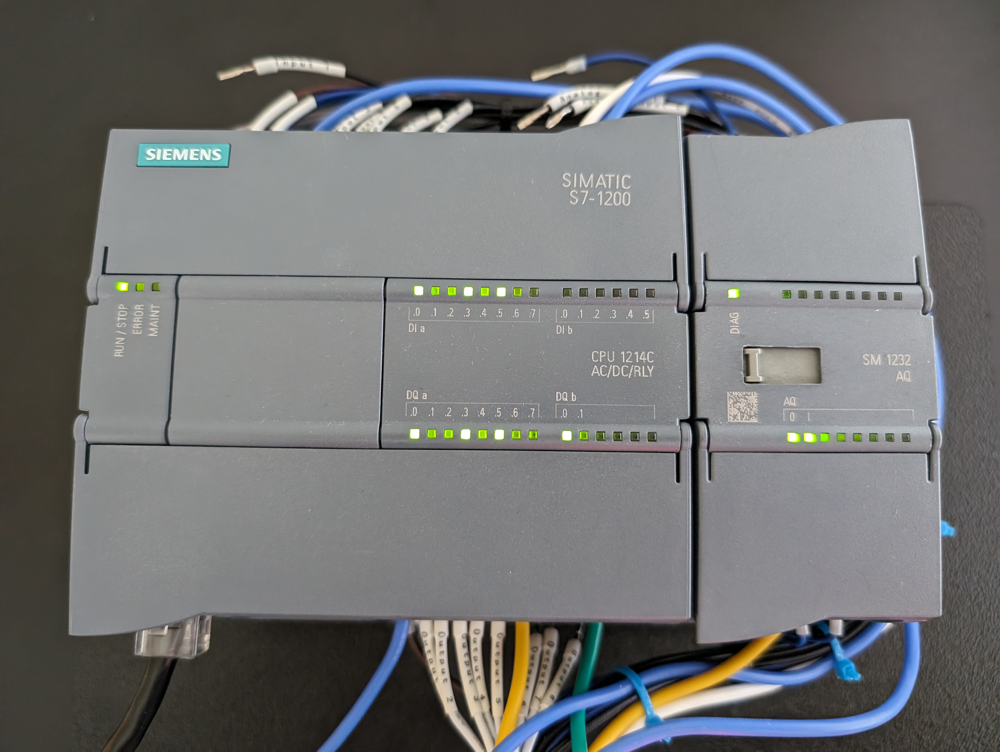
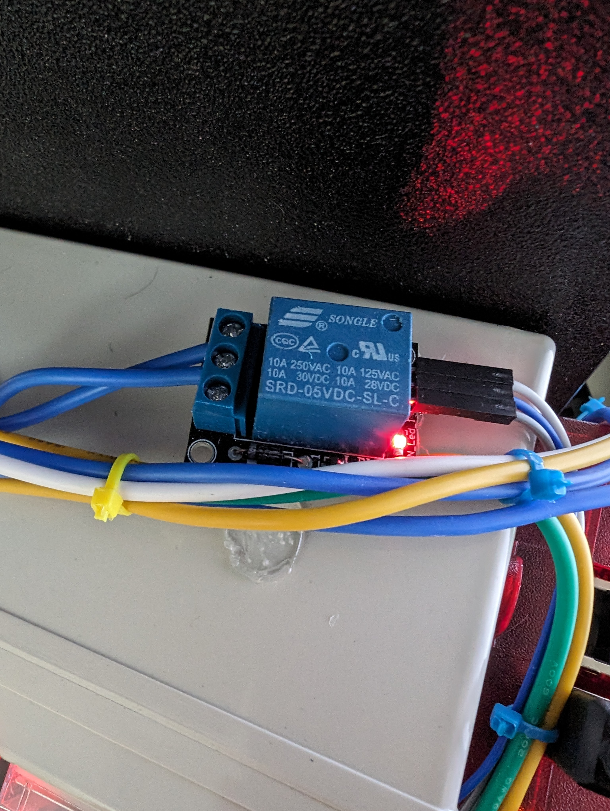

# HIL Topology HIL Wiring
This document contains instructions for wiring up the hardware-in-the-loop of the Hardware-In-the-Loop Topology 

T4 is a LabJack T4: 
S7 is a Siemens S7-1214 PLC with an Analog module attachement: 
RLY is a relay: 

The relay does not have pin numbers/names, so the following convention is used: 
The top of the relay is the top long side when held such that the lettering appears 'normal'.
Then the pins on the left side are named L0,L1,L2, from bottom to top.
The pins on the right side are are named R0,R1,R2, from top to bottom.

## Physical wiring
A $1~k\Omega$ resistor is placed between GND and FIO6 on the LabJack as a pull-down resistor

* T4 <-> T4
    * GND <- $1~k\Omega$ -> FIO6

* T4 <-> S7
    * FIO6 <-> DQb.0
    * VS <-> AI.2M
    * DAC0 <-> AI.0
    * DAC1 <-> AI.1
    * AIN1 <-> AQ.0

* RLY <-> T4
    * R0 <-> GND
    * R1 <-> VS
    * R2 <-> FIO4

* RLY <-> S7
    * L2 <-> DIa.0
    * L1 <-> DQa.1L

## Software Wiring
soap-hil Ignition:
Inside Ignition, the following tags are assigned to the PLC:

| Ignition Tag                          | Data Type | OPC Item Path         | PLC Pin   |
| ------------------------------------- | --------- | --------------------- | --------- |
| `AI_Voltage-1`                        | `Float`   | `ns=1;s=[s7];IW64`    | `AI.0`    |
| `AO_Voltage-1`                        | `Float`   | `ns=1;s=[s7];QW96`    | `AQ.0`    |
| `BI_switch-1-Branch242-243-Active`    | `Boolean` | `ns=1;s=[s7];IX0.0`   | `DIa.0`   |
| `DO_B-1=Branch242-243-control`        | `Boolean` | `ns1;s=[s7];QX1.0` 	| `DQ.a.1L` |

The analog tags need to be scaled properly, as Ignition reads the PLC's internal representation for analog data.

The PLC internal representation of analog values is from -27648 to +27648, or -10V to +10V.
But the LabJack can only do 0-5V, which is 0 to 13824 on the PLC.
The Ignition scaling then needs to be:

| Parameter     |  Value    |
| ------------- | --------- |
| Scale Mode    | `Linear`  |
| Raw Low       | `0`       |
| Raw High      | `13824`   |
| Scaled Low    | `0`       |
| Scaled High   | `100`     |

The tag `AI_Voltage-1` is connected to the `Generator-1_Bus-243` `Active Load (MW)` display.
The tag `AO_Voltage-1` is connected to the `Generator-1_Bus-243` `MW Setpoint` field.
