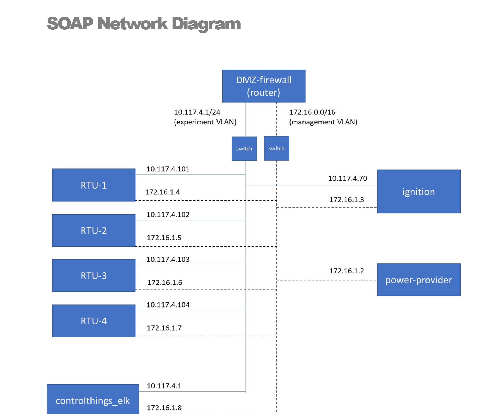

# Overview
The SOAP topology models a notional SCADA system for a 300 bus microgrid system. The model uses PyPower to model the physical process itself, Ignition SCADA software, and additionally includes the ControlThings.io envirnoment to additioanlly provide a testing suite for the ICS environment. 



# Configuration Files
The model consists of the following configurations: 
- `soap-topology.yaml` - This defines the network topology for the SOAP model.
- `sceptre.yaml` - This defines the sceptre app configuration needed to add the ICS specifics to the topology.
- `soh.yaml` - Defines the state of health (soh) app configuration for the SOAP topology.
- `soap-scenario.yaml` - This defines the entirety of the scenario configurations needed. This pulls together the `sceptre` and `soh` configurations and adds the mirror app. 

# Images
The model uses the following backing images:
- `bennu.qc2`
- `ignitionhmi.qc2`
- `controlthingsplatform.qc2`

The bennu image can be built using `phenix image`. See here for more details. 
The hmi and control things images are included in this distribution in the images folder.

# Deploying SOAP
1. Copy the entire contents of this topology to `/phenix/topologies/soap`. Phenix topologies can technically be located anywhere, but the SOAP topology looks for injects from this location. 
2. Move the images located in the `images` folder to `/phenix/images`.
3. Add the SOAP configs to the data store using the following commands:
```
phenix config create <path_to_topos>/soap-topology.yaml
phenix config create <path_to_topos>/sceptre.yaml
phenix config create <path_to_topos>/soh.yaml
phenix config create <path_to_topos>/soap-scenario.yaml
```
4. Run the SOAP model using the following commands:
```
phenix exp create soap -t soap -s soap
phenix exp start soap 
```
5. Stop and delete the model using the following commands:
```
phenix exp stop soap
phenix exp delete soap
```

For more information on the SOAP topology see the `SOAP_User_Guide__UUR__20200817.pdf`
For more information on installing and running phenix see the Phenix Quick Start Guide. 
