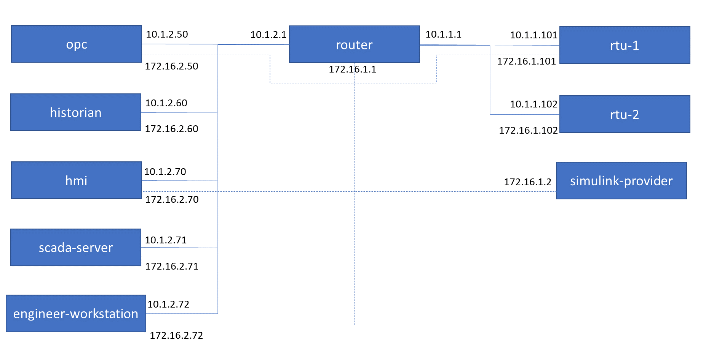

The waterway topology models a notional SCADA system for a waterway lock system. The model uses Matlab Simulink for modeling the waterway physics. The model uses OPC TOP Server, mySCADA, and Wonderware historian SCADA software.  



The model consists of the following configurations: 
- waterway-topology.yaml` - This defines the network topology for the waterway model.
- `waterway-scenario.yaml` - This defines the scenario configuration including the sceptre app.

The model uses the following backing images:
- `bennu.qc2` - the bennu image can be built using `phenix image` with the following commands:
    ```
    phenix image create -O /phenix/vmdb2/overlays/bennu,/phenix/vmdb2/overlays/brash -T /phenix/vmdb2/scripts/bennu --format qcow2 --release focal -c bennu
    phenix image build bennu -o /phenix -c -x
    ```
- `engineer_workstation.qc2` - the engineer workstation image is a Windows 7 based image which requires licensing. The user must license and build their own image.  
- `historian.qc2` - the historian image is a Windows Server 2008 R2 based image with Wonderware historian SCADA software installed. Both require licensing and the user must license and build their own image.
- `hmi_win7.qc2` - the hmi image is a Windows 7 based image which requires licensing. The user must license and build their own image.  

- `minirouter.qc2` - the minirouter image can be built using `phenix image` with the following commands:
    ```
    phenix image build build minirouter -o <output path> -c -x
    ```
- `opc.qc2` a Windows Server 2008 R2 based image with OPC TOP Server software installed. Both require licensing and the user must license and build their own image.
- `scada.qc2` a Windows Server 2008 R2 based image with mySCADA software installed. Both require licensing and the user must license and build their own image.

To run the model use the following commands
```
phenix config create <path_to_topos>/waterway-topology.yaml
phenix config create <path_to_topos>/waterway-scenario.yaml
phenix exp create waterway -t waterway -s waterway
```
